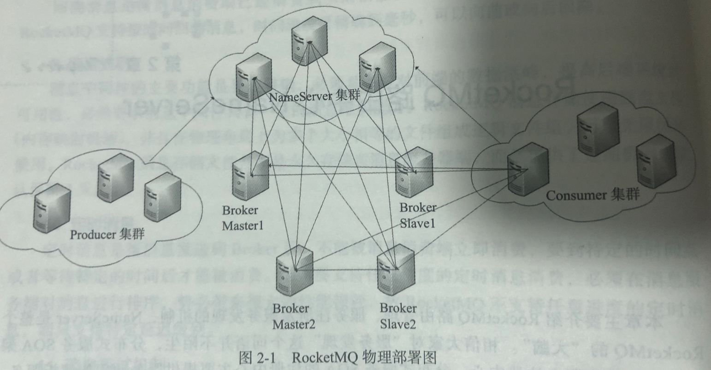

## NameServer 的架构设计

### NameServer介绍

消息中间节的设计思路一班基于主题的订阅发布机制，消息生产者Producer发送某一主题的消息到消息服务器，消息服务器负责该消息的持久化存储，消息
消费者Consumer订阅感兴趣的消息主题，消息服务器根据订阅消息将消息推送到消费者PUSH模式或者消息消费者主动向消息服务器拉取消息PULL模式，从而
实现消息生产者与消费者的解耦。

为了避免消息服务器的单点故障导致整个系统瘫痪，通常会部署多台消息服务器共同承担消息的存储。那么存在如下问题：

- 消息生产者如何知道消息要发往那台消息服务器
- 如果某一台消息服务器宕机了，那么生产者如何在不重启服务的情况下感知到

NameServer的存在就是解决上述的问题,下图为RocketMQ的部署架构图



Broker消息服务器在启动时向所有的NameServer注册，消息生产者在发送消息之前先从NameServer获取Broker服务器地址列表，然后根据负载均衡算法从
列表中选择一台进行消息发送，*NameServer与每台Broker服务器保持长连接，并间隔30S检测Broker是否存活，若果Broker宕机会从NameServer中移除*
但是这不会马上通知生产者，这是为了降低NameServer的复杂性（后面会进行介绍）。

NameServer本身的高可用可以通过部署多台NameServer服务器来实现，*但NameServer彼此之间互不通信，也就是说NameServer服务器之间在某一时刻数据并不会完全相同*

### NameServer 启动流程

NameServer启动类：`org.apache.rocketmq.namesrv.NamesrvStartup`
NameServer启动参数：NameServer启动必须参数只需要通知启动参数配置`rocketmq.home.dir` 或者配置`ROCKET_MQ_HOME`


`NamesrvConfig`参数说明：
- rocketmqHome：设置RocketMQ的家目录可以通过-D参数指定也可以通过环境变量指定
- kvConfigPath： NameServer 存储KV配置属性的持久化路径，这里有一个以为KV就是什么
- configStorePath： 默认配置文件路径不会生效，nameServer启动时如果要通过配置文件配置NameServer启动属性的话，使用-c选项。
- orderMessageEnable： 是否支持顺序消息
- productEnvName：？
- clusterTest：？

`NettyServerConfig`参数说明，参数过多不再进行列举，具体看代码

在配置解析完成之后开始创建`NamesrvController`，同时如果`NameServer`再启动时候通过`-c`参数指定配置文件，那么在实例化完成`NamesrvController`
之后会将配置文件中的数据跟代码中的数据进行merge操作。

`NamesrvController`为NameServer的核心控制器，在实例化完成之后开始进行初始化

```
public boolean initialize() {

    this.kvConfigManager.load();

    this.remotingServer = new NettyRemotingServer(this.nettyServerConfig, this.brokerHousekeepingService);

    this.remotingExecutor =
        Executors.newFixedThreadPool(nettyServerConfig.getServerWorkerThreads(), new ThreadFactoryImpl("RemotingExecutorThread_"));

    this.registerProcessor();

    this.scheduledExecutorService.scheduleAtFixedRate(new Runnable() {

        @Override
        public void run() {
            NamesrvController.this.routeInfoManager.scanNotActiveBroker();
        }
    }, 5, 10, TimeUnit.SECONDS);

    this.scheduledExecutorService.scheduleAtFixedRate(new Runnable() {

        @Override
        public void run() {
            NamesrvController.this.kvConfigManager.printAllPeriodically();
        }
    }, 1, 10, TimeUnit.MINUTES);

    if (TlsSystemConfig.tlsMode != TlsMode.DISABLED) {
        // Register a listener to reload SslContext
        try {
            fileWatchService = new FileWatchService(
                new String[] {
                    TlsSystemConfig.tlsServerCertPath,
                    TlsSystemConfig.tlsServerKeyPath,
                    TlsSystemConfig.tlsServerTrustCertPath
                },
                new FileWatchService.Listener() {
                    boolean certChanged, keyChanged = false;
                    @Override
                    public void onChanged(String path) {
                        if (path.equals(TlsSystemConfig.tlsServerTrustCertPath)) {
                            log.info("The trust certificate changed, reload the ssl context");
                            reloadServerSslContext();
                        }
                        if (path.equals(TlsSystemConfig.tlsServerCertPath)) {
                            certChanged = true;
                        }
                        if (path.equals(TlsSystemConfig.tlsServerKeyPath)) {
                            keyChanged = true;
                        }
                        if (certChanged && keyChanged) {
                            log.info("The certificate and private key changed, reload the ssl context");
                            certChanged = keyChanged = false;
                            reloadServerSslContext();
                        }
                    }
                    private void reloadServerSslContext() {
                        ((NettyRemotingServer) remotingServer).loadSslContext();
                    }
                });
        } catch (Exception e) {
            log.warn("FileWatchService created error, can't load the certificate dynamically");
        }
    }

    return true;
}
```


